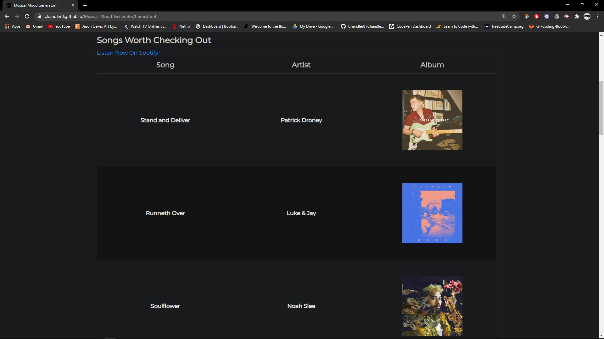

# Musical Mood Generator

An interactive web application that generates users a unique music playlist and GIF depending upon their mood via the Spotify and GIPHY APIs. The user can select one of eight differing moods via a number of ways including; a convenient dropdown menu, voice recognition, or face ID. The user can simply choose the desired outcome by selecting one of these eight moods that include; Happy, Sad, Energetic, Aggressive, Relaxed, Sleepy, Classy, or Indifferent. Upon choosing a mood, the website will generate the user a playlist and GIF that correlates to their mood. The link to this playlist will be clickable and will redirect the user to this playlist on Spotify for convenient listening. The user can find past moods with their corresponding GIF listed on the NAV bar at the top of the page. Within this window the user can view their past moods with an exact time stamp attatched to when they had this mood. All HTML, CSS, and JS successfully ran through validation services. To view the deployed application please follow this link: https://chandler8.github.io/Musical-Mood-Generator/

## Features

A few of the things you can do with Musical Mood Generator:

* Input your mood via dropdown menu
* Utilize voice recognition for mood input 
* Take advantage of face ID if you don't know what mood you are in
* Have playlists and GIFs generated for you based on your mood
* Quick access to these playlists on Spotify
* The ability to view your past moods with an extact time stamp

## User Story

```
As a user, I want
    -to have music playlists based on my mood
    -to generate a random corresponding gif based on the mood
    -to know what my music mood was in the past

so that
    -I can have something enjoyable to listen to that aligns with my mood
    -I can laugh at something relatable when I'm feeling this mood
    -I can keep track of my moods and music that I might have liked 

when
    -I enter my mood from a drop down menu
    -I click on my past mood history
    -I press the voice recognition button
    -I press the face ID button
    -I click a link on the home page


then
    -a playlist of songs and corresponding GIF is generated based on the mood selected
    -a list of my past moods, the GIF, and an accurate time stamp is displayed
    -a microphone button allows me to speak my mood into my computer
    -a modal loads that accesses my webcam and takes a photo of me to assess my mood
    -a new tab loads with a Spotify playlist or an APIs homepage


```

# Contributors

| Chandler
------------ 

[<br /><sub><b>Chandler Lowrance</b></sub>](https://github.com/Chandler8)<br />[💻](https://github.com/Chandler8?tab=repositories "Repositories")

| Jacob
------------ 
[<br /><sub><b>Jacob Lovins</b></sub>](https://github.com/jacoblovins)<br />[💻](https://github.com/jacoblovins?tab=repositories "Repositories")

| Erika
------------ 

[<br /><sub><b>Erika Beasley</b></sub>](https://github.com/erikabeasley)<br />[💻](https://github.com/erikabeasley?tab=repositories "Repositories")

## Images





